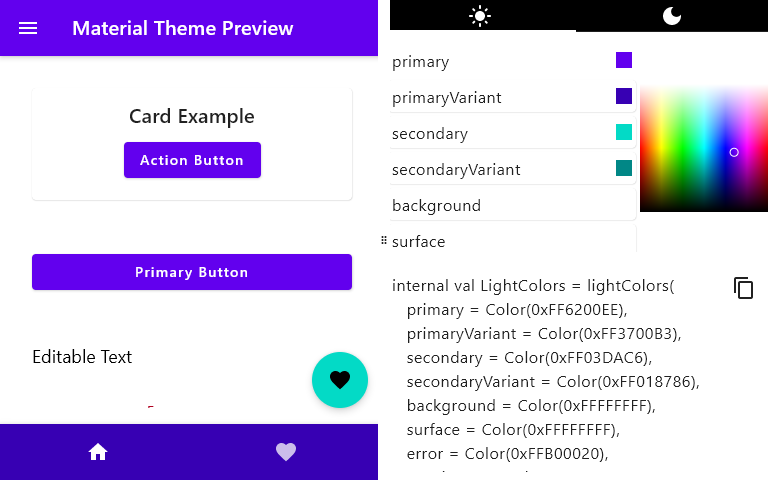

<h1 align="center">Materialize</h1>

Material design color scheme generator GUI for Jetpack Compose application theming

# Usage

- Choose colors for light and/or dark theme
- Copy code to your project and use in material theme

___

  
   
  <a href="https://numq.github.io/support" style="text-decoration: none;">
    <code>numq.github.io/support</code>
  </a>

